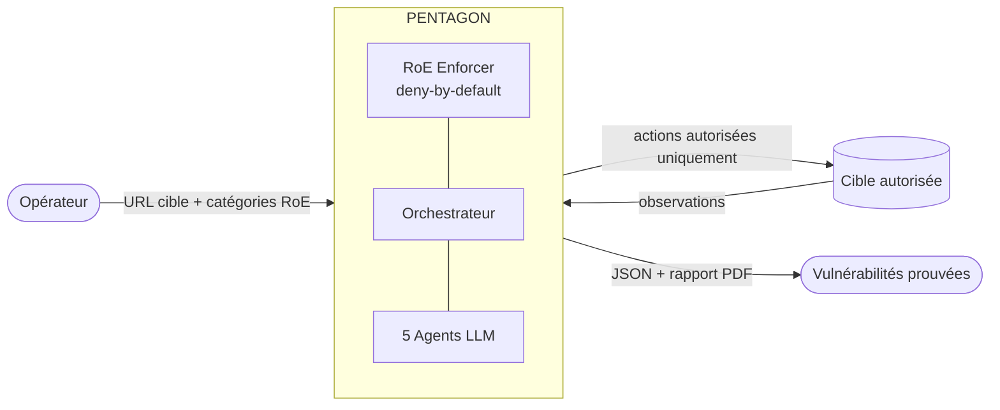
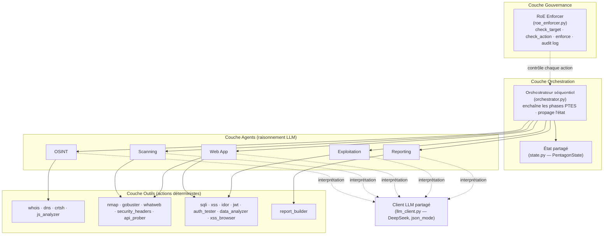
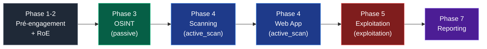
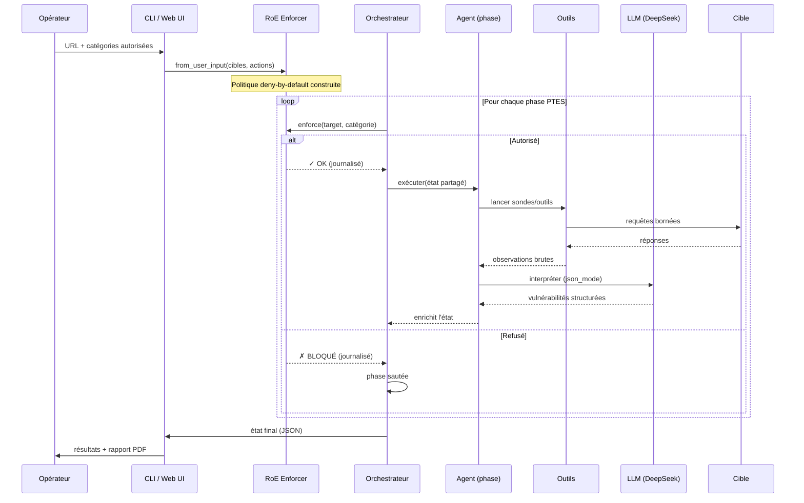
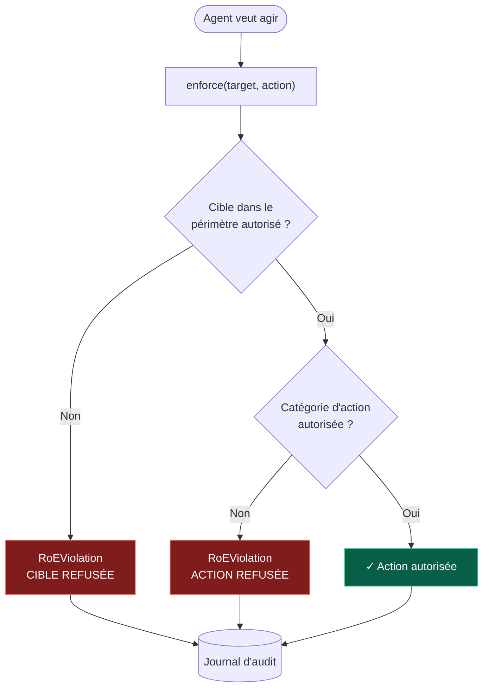
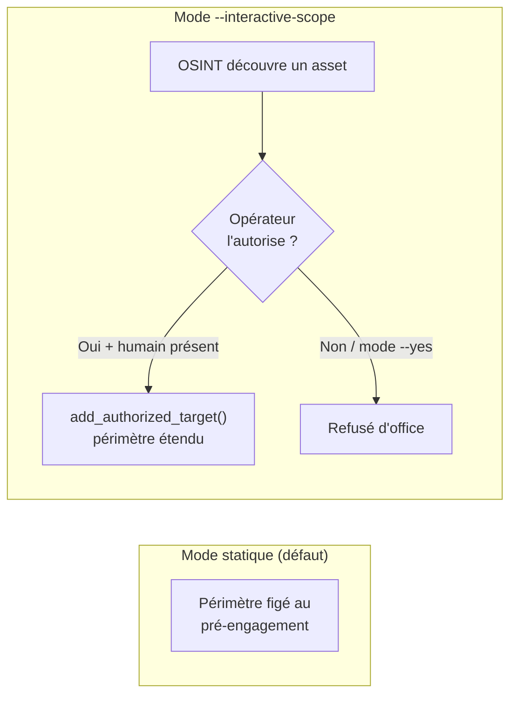
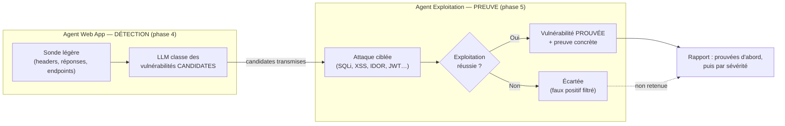
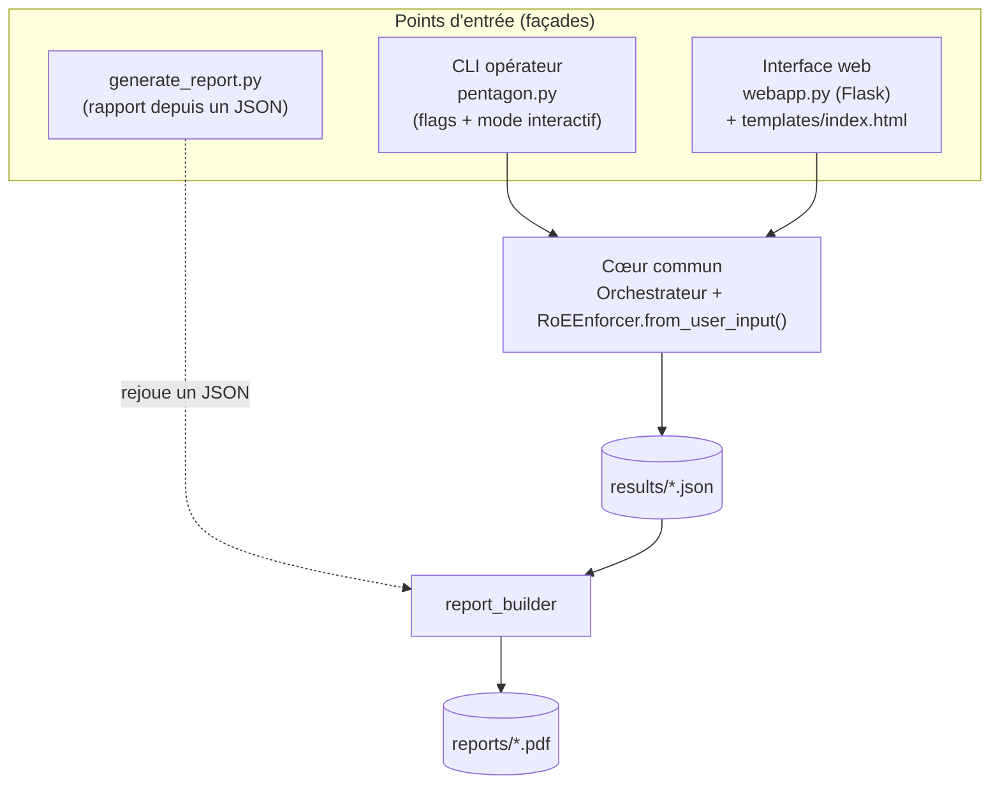
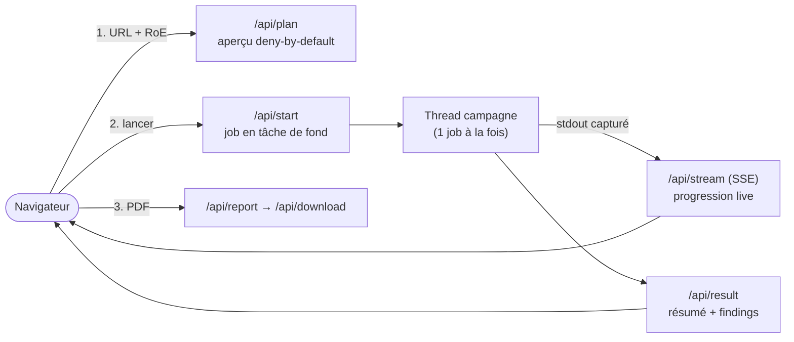
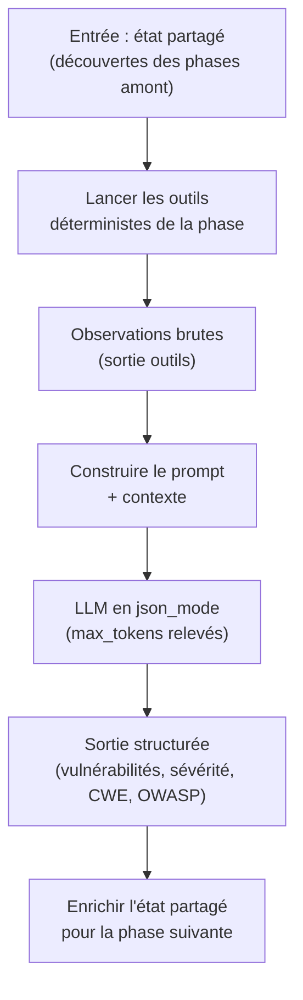

# PENTAGON — Présentation détaillée de l'outil

> Système multi-agent de test d'intrusion automatisé, piloté par LLM (DeepSeek).
> Mémoire de Master 2 — Systèmes & Réseaux (UADB, Sénégal).

---

## 1. La problématique

Le test d'intrusion (pentest) est aujourd'hui une activité **manuelle, coûteuse et rare** :

- il exige un expert qui enchaîne des dizaines d'outils (reconnaissance, scan, exploitation, rapport) ;
- chaque cible est traitée « à la main », ce qui limite la fréquence des audits ;
- les outils automatiques classiques (scanners de vulnérabilités) produisent **beaucoup de bruit** (faux positifs) et **ne prouvent pas** réellement l'exploitabilité d'une faille.

**Question de recherche :** peut-on déléguer le *raisonnement* d'un pentesteur à un système multi-agent piloté par un LLM, tout en gardant des **garde-fous éthiques et légaux stricts** ?

PENTAGON répond à trois exigences simultanées :

| Exigence | Réponse PENTAGON |
|---|---|
| **Autonomie** | Une chaîne d'agents enchaîne les phases sans intervention manuelle. |
| **Preuve, pas seulement détection** | Une faille n'est retenue que si elle est **exploitée** (démonstration concrète). |
| **Encadrement** | Un *RoE Enforcer* « deny-by-default » borne strictement le périmètre et les actions. |

Devise de conception : **« détecter en prouvant, jamais ravager »** (prouver l'exploitabilité sans action destructrice).

---

## 2. Vue d'ensemble

PENTAGON transforme une simple entrée opérateur (une URL + des autorisations) en un **rapport de vulnérabilités prouvées**.



Deux idées structurantes :

1. **Séparation stricte code / configuration.** Le code générique ne connaît **aucune cible**. La cible et les autorisations viennent toujours de l'opérateur (CLI ou interface web). Aucune faille n'est « codée en dur ».
2. **Le LLM raisonne, les outils agissent.** Les agents n'inventent pas de résultats : ils lancent des **outils déterministes** (Nmap, testeurs SQLi/XSS, analyseur JWT…) et demandent au LLM d'**interpréter** les observations.

---

## 3. Architecture en couches

PENTAGON est organisé en **4 couches**, du plus concret (outils) au plus gouvernant (RoE).



**Principe clé :** un agent ne touche jamais la cible sans que l'orchestrateur ait interrogé le RoE Enforcer au préalable (`enforce(target, action_category)`).

---

## 4. Les phases PTES et la chaîne d'agents

PENTAGON suit le standard **PTES** (Penetration Testing Execution Standard). Chaque agent porte une phase.



Correspondance **phase → agent → catégorie RoE → outils** :

| Phase PTES | Agent | Catégorie RoE | Rôle | Outils principaux |
|---|---|---|---|---|
| 3 — Reconnaissance | **OSINT** | `passive` | Cartographier la cible sans la toucher | `whois`, `dns`, `crtsh`, `js_analyzer` |
| 4 — Analyse de vulnérabilités | **Scanning** | `active_scan` | Découvrir services, ports, techno | `nmap`, `gobuster`, `whatweb`, `security_headers` |
| 4 — Analyse applicative | **Web App** | `active_scan` | Détecter les failles web candidates | `api_prober`, `security_headers`, sondes SQLi/XSS légères |
| 5 — Exploitation | **Exploitation** | `exploitation` | **Prouver** l'exploitabilité | `sqli`, `xss`, `idor`, `jwt`, `auth_tester`, `xss_browser` |
| 7 — Rapport | **Reporting** | — | Assembler un rapport unifié | `report_builder` → PDF |

> Chaque catégorie est **opt-in** : si l'opérateur n'autorise pas `exploitation`, la phase 5 est simplement **sautée** (deny-by-default).

---

## 5. Le workflow d'une campagne (bout en bout)

Voici la séquence complète d'une campagne, du clic opérateur au rapport.



Points à retenir :

- L'**état partagé** (`PentagonState`) circule d'un agent à l'autre : l'OSINT découvre des endpoints → le Web App les teste → l'Exploitation les prouve.
- Chaque décision RoE (autorisée/refusée) est **journalisée** pour l'audit.
- L'appel LLM est en **mode JSON forcé** (`response_format=json_object`) pour garantir une sortie exploitable (correctif du bug de troncature).

---

## 6. La gouvernance : le RoE Enforcer

C'est le cœur éthique/légal de PENTAGON. **Rien n'est autorisé par défaut.**



**Deux modes de périmètre :**



Garde-fous notables :

- La catégorie **`destructive` n'est jamais proposée** dans l'interface (charte éthique).
- En mode non-supervisé (`--yes`), **aucun élargissement** de périmètre n'est possible.
- L'accord *technique* du RoE ne vaut **jamais** autorisation *légale* : le rappel est explicite dans le dialogue.

> ⚠️ Contrainte fondamentale : PENTAGON ne doit tester que des cibles que l'opérateur **possède** ou pour lesquelles il a une **autorisation écrite explicite** (mandat de pentest, bug bounty en périmètre, lab d'entraînement). Tout test non autorisé est illégal.

---

## 7. Le pipeline « détecter → prouver »

La spécificité de PENTAGON par rapport à un scanner classique : il ne se contente pas de *signaler*, il **exploite pour confirmer**.



Dans le rapport, chaque faille porte une **source** :
- **« prouvée »** (agent Exploitation) : accompagnée de la *preuve* de l'exploitation ;
- **« détectée »** (agent Web App) : candidate non encore exploitée.

L'interface affiche pour chaque vulnérabilité : **nom + description + impact sécurité interprété par le LLM + correctif**.

---

## 8. Comment on intègre PENTAGON dans un système

Trois façades, **un même cœur** (Orchestrateur + RoE) :



### Intégration par ligne de commande

```bash
python pentagon.py --target https://cible-autorisee.example \
  --actions passive,active_scan,exploitation \
  --operator rokhaya --yes --report
```

- **Import différé** de la stack LLM dans `run_mission()` → `--help`, la saisie et la confirmation tournent en Python pur (testables hors-ligne).
- Le flag `--report` génère le PDF en fin de campagne.

### Intégration par interface web (opérateur)



- La campagne tourne dans un **thread de fond**, sa sortie est **streamée en direct** (Server-Sent Events).
- Les imports LLM/reportlab sont **différés** → `webapp.py` s'importe sans la stack.
- **Un seul job actif** à la fois (outil local mono-opérateur).

### Contraintes de déploiement

- La stack LLM (DeepSeek) et les outils réseau tournent sur une machine d'audit (**Kali**), pas sur un poste bureautique.
- Une console web exposée publiquement **doit** être placée **derrière une authentification opérateur** — jamais une console d'attaque ouverte.

---

## 9. Anatomie d'un agent (modèle commun)

Tous les agents suivent le même patron : **agir (outils) → interpréter (LLM) → enrichir l'état**.



Ce découplage garantit que **le LLM ne fabrique jamais de preuve** : il n'interprète que des observations réellement produites par les outils.

---

## 10. Cible de validation & résultats

Pour prouver la **généricité** (indépendance à la stack de la cible), PENTAGON a été validé sur une cible maison volontairement vulnérable, **VulnShop** :

- Stack **Node.js/Express + SPA vanilla + SQLite (sql.js/WASM)**, service unique (API + front même origine).
- Déployée en ligne (Render + domaine perso, derrière Cloudflare).
- Données **100 % factices** (faux comptes, cartes de test) ; base éphémère réinitialisée à chaque démarrage.

**Résultat de campagne complète (sur Kali) :** 4 agents, **0 erreur**, **9 vulnérabilités prouvées**, risque global **critique**, PDF généré — couvrant **7/7 catégories OWASP** ciblées (A01 IDOR, A02 JWT faible / MD5 + cartes, A03 SQLi + XSS, A07 creds par défaut + JWT sans expiration).

> Généricité démontrée : mêmes agents, mêmes outils, **zéro code spécifique** à la cible, sur une stack différente de la première cible historique (Java).

---

## 11. Limites et perspectives

| Limite actuelle | Perspective |
|---|---|
| Orchestrateur **séquentiel** simple | Migration vers **LangGraph** (checkpointing, transitions conditionnelles, parallélisme) |
| Couverture centrée **OWASP Top 10 web** | Ajout de familles hors Top 10 (TLS/SSL, DNS/e-mail, config HTTP, réseau/services) |
| Scope interactif seulement en **CLI** | Porter l'élargissement supervisé dans l'UI web |
| Confirmation XSS navigateur **séparée** (Playwright) | Câbler la voie navigateur directement dans l'agent Exploitation |

---

## 12. Résumé en une phrase

**PENTAGON** prend une cible autorisée et des permissions explicites, enchaîne cinq agents LLM le long des phases PTES sous le contrôle d'un garde-fou *deny-by-default*, **prouve** les vulnérabilités en les exploitant de façon non destructrice, et produit un rapport unifié — le tout sans jamais coder de cible en dur ni franchir le périmètre autorisé.
